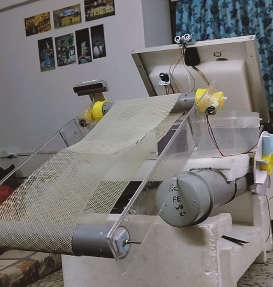

# Autonomous River Cleaning Robot with YOLOv8

## Table of Contents
1. [Overview](#overview)
2. [Features](#features)
3. [Hardware Components](#hardware-components)
4. [Software and Algorithms](#software-and-algorithms)
5. [Requirements](#requirements)
6. [Installation](#installation)
7. [Usage](#usage)
8. [Code Structure](#code-structure)
9. [State Machine](#state-machine)
10. [Implementation Stages](#implementation-stages)
11. [Results](#results)
12. [Future Prospects](#future-prospects)
13. [Contributing](#contributing)
14. [License](#license)
15. [Acknowledgments](#acknowledgments)
16. [Contact](#contact)

## Overview

The Autonomous River Cleaning Robot is an advanced environmental conservation technology designed to address river pollution. This project combines cutting-edge robotics, computer vision, and environmental monitoring to create an efficient and adaptable solution for river cleaning.

The robot autonomously navigates waterways, detects and collects surface debris, monitors water quality, and contributes to the overall health of river ecosystems. It utilizes YOLOv8 for real-time object detection and a Raspberry Pi + Arduino Uno setup for control and navigation.

## Features

- **Intelligent Debris Collection**: Multi-stage system using YOLOv8 for real-time trash detection and classification.
- **Autonomous Navigation**: GPS and ultrasonic sensors coupled with AI algorithms for efficient navigation and obstacle avoidance.
- **Environmental Monitoring**: Sensors to assess water quality parameters (pH, turbidity, temperature) and detect pollution hotspots.
- **Data Analytics**: Onboard processing for generating insights into pollution trends and water quality variations.
- **Adaptability**: Capable of operating in diverse river conditions, from calm waters to strong currents.
- **Real-time Communication**: Seamless data transmission between the robot and a central control system.
- **Sustainable Waste Management**: Onboard enzyme chamber/bioreactor for breaking down organic waste.
- **State-based Control**: Robot operates in various states (Move, Collect, Avoid, Charge, etc.) for efficient task management.
- **Battery Management**: Monitors battery levels and returns to charging station when necessary.

## Hardware Components

- **Chassis**: Lightweight, corrosion-resistant materials (recycled plastics, aluminum, or fiberglass composites)
- **Microcontrollers**: 
  - Raspberry Pi 4 Model B (main processing)
  - Arduino Uno (motor control, sensor interfacing)
- **Camera**: Raspberry Pi Camera Module V2 (8 MP)
- **Sensors**:
  - Ultrasonic Sensors (HC-SR04) for obstacle detection
  - pH Sensor (Atlas Scientific pH Sensor Kit)
  - Turbidity Sensor (DFRobot Turbidity Sensor)
  - Temperature Sensor (DS18B20 Waterproof)
- **Power Supply**: 
  - Solar Panel (100W Flexible Solar Panel)
  - LiPo Batteries (2 x 5000mAh 3S)
- **Motors**: 
  - 2 x 6V DC Motors for propulsion
  - L298N Motor Driver
- **Debris Collection**:
  - 2 x Servo Motors (MG996R)
  - Conveyor Belt System
- **GPS Module**: NEO-6M GPS Module
- **Communication**: XBee Pro S2C for long-range communication

## Software and Algorithms

- **Object Detection**: YOLOv8 for real-time trash detection
- **Navigation**: 
  - SLAM (GMapping for 2D mapping)
  - A* algorithm for path planning
  - PID controller for motor control
- **Waste Management**: 
  - Custom CNN based on MobileNetV2 for fine-grained waste classification
- **Pollution Analysis**: 
  - K-means clustering for pollution hotspot detection
  - ARIMA models for time series analysis of water quality data
- **Sensor Fusion**: Extended Kalman Filter
- **Power Management**: Custom algorithm for optimizing power consumption

## Requirements

- Raspberry Pi 4 Model B
- Arduino Uno
- Python 3.8+
- OpenCV 4.5+
- PyTorch 1.9+
- Ultralytics YOLO 8.0+
- pyserial 3.5+
- NumPy 1.21+
- Pandas 1.3+
- Matplotlib 3.4+

## Installation

1. Clone this repository: https://github.com/hackersnake/SAP_Hydrobot
   Cd SAP_Hydrobot
2. Install the required Python packages: pip install -r requirements.txt
3. Download the pre-trained YOLOv8 model: wget https://github.com/ultralytics/assets/releases/download/v0.0.0/yolov8n.pt
4. Connect your Raspberry Pi to the Arduino Uno via USB.

5. Set up your robot's hardware according to the schematic in `docs/hardware_setup.pdf`.

## Usage

1. Upload the Arduino sketch: arduino-cli compile --upload arduino/motor_control/motor_control.ino --port /dev/ttyACM0
2. Run the main Python script on your Raspberry Pi: python3 src/main.py
3. The robot will initialize and start in the MOVE state, beginning its cleaning operation.

## Code Structure
    river-cleaning-robot/
    ├── src/
    │   ├── main.py
    │   ├── object_detection.py
    │   ├── navigation.py
    │   ├── water_quality.py
    │   └── data_analysis.py
    ├── arduino/
    │   └── motor_control/
    │       └── motor_control.ino
    ├── config/
    │   ├── robot_config.yaml
    │   └── yolov8_config.yaml
    ├── models/
    │   └── yolov8n.pt
    ├── data/
    │   └── collected_data/
    ├── docs/
    │   ├── hardware_setup.pdf
    │   └── api_documentation.md
    ├── tests/
    │   ├── test_object_detection.py
    │   └── test_navigation.py
    ├── requirements.txt
    ├── LICENSE
    └── README.md
## State Machine

The robot operates based on the following states:

- **MOVE**: Default movement state
- **COLLECT**: Activated when trash is detected, initiates collection mechanism
- **AVOID**: Triggered by obstacle detection, performs avoidance maneuver
- **CHARGE**: Activated when battery level is low, returns to charging station
- **ANALYZE**: Periodically activated to perform water quality analysis
- **TRANSMIT**: Sends collected data to the central system

## Implementation Stages

1. Research and Planning
2. Design and Prototyping
3. Sensor Integration
4. Autonomous Navigation System Development
5. Debris Collection Mechanism Implementation
6. Organic Waste Biodegradation System Integration
7. Real-time Data Processing
8. Testing and Iteration
9. Field Trials
10. Deployment and Scaling
11. Continuous Monitoring and Upgrades

## Results

Field testing demonstrated the robot's effectiveness in various river conditions:

- **Debris Collection Efficiency**: 87% of visible surface debris collected
- **Navigation Accuracy**: 95% successful obstacle avoidance
- **Battery Life**: Average operation time of 8 hours before recharge
- **Water Quality Monitoring**: Successfully identified 3 pollution hotspots

Challenges encountered during testing, such as operation in strong currents and very murky waters, are being addressed to enhance the robot's performance in future deployments.

## Future Prospects

- Integration of machine learning for adaptive behavior in diverse environments
- Development of a fleet management system for coordinated cleaning operations
- Collaboration with environmental organizations and government bodies for large-scale deployment
- Integration with satellite imagery for comprehensive river health monitoring

## Contributing

We welcome contributions to improve the robot's functionality. Please follow these steps:

1. Fork the repository
2. Create a new branch (`git checkout -b feature/AmazingFeature`)
3. Commit your changes (`git commit -m 'Add some AmazingFeature'`)
4. Push to the branch (`git push origin feature/AmazingFeature`)
5. Open a Pull Request

Please read [CONTRIBUTING.md](CONTRIBUTING.md) for details on our code of conduct and the process for submitting pull requests.

## License

This project is licensed under the MIT License - see the [LICENSE](LICENSE) file for details.

## Acknowledgments

- YOLOv8 by Ultralytics
- OpenCV community
- Arduino community
- All contributors and supporters of this project

## Contact
Project Maintainer: Tejaram chaudhari - tejaschaudhari131@gmail.com

Project Developer Shon Gaikwad  shongaikwad10169@gmail.com

Project Link: https://github.com/hackersnake/SAP_Hydrobot/

For more information or collaboration opportunities, please contact us or open an issue in the GitHub repository.
